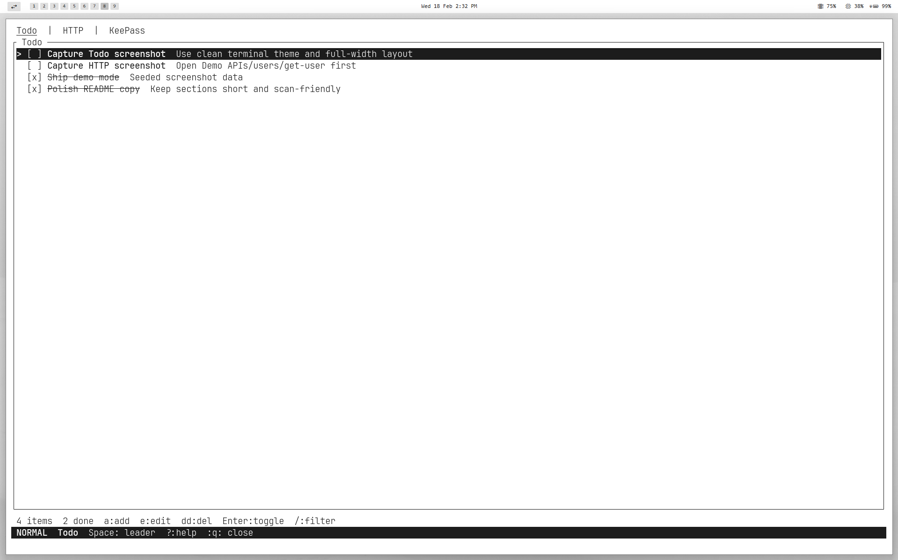
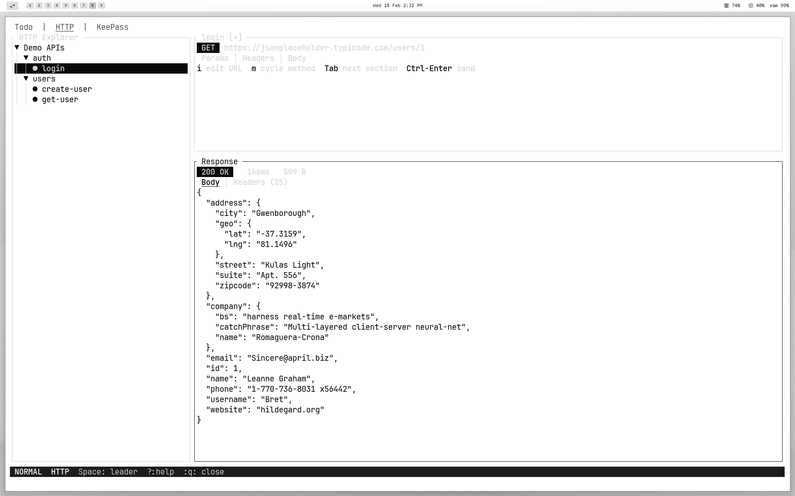
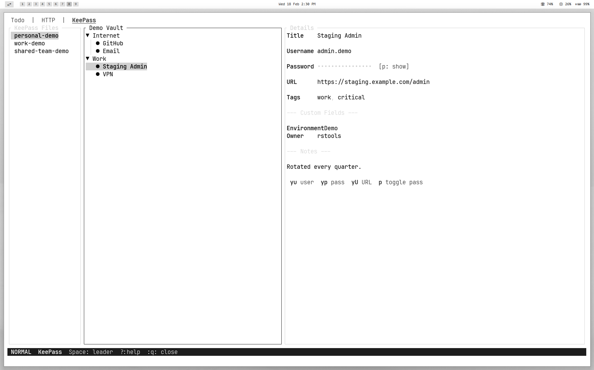
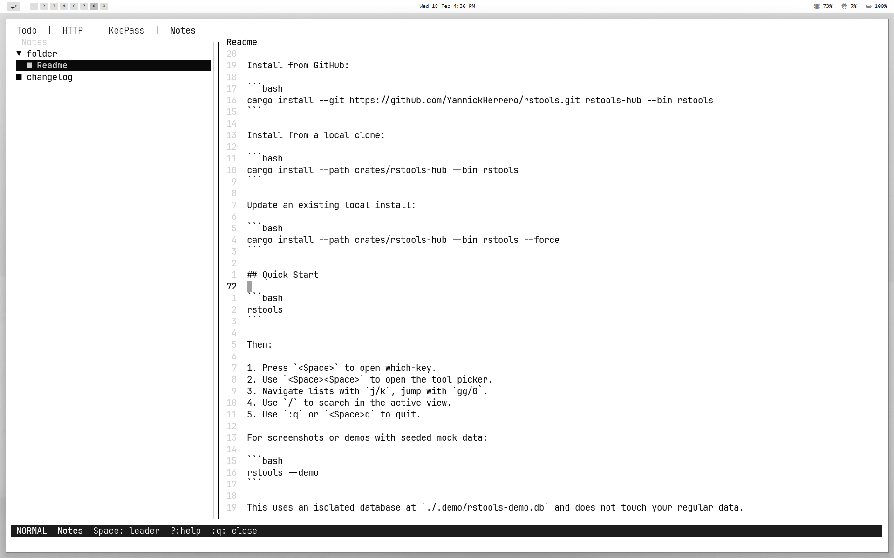

# rstools

[](LICENSE)
[](https://www.rust-lang.org/)

A vim-centric terminal toolkit built in Rust with [ratatui](https://ratatui.rs): one app, multiple tools, modal-first UX.

## Philosophy

rstools is a collection of independent terminal tools unified by a single hub.
The entire UX is modeled after neovim with modal editing, hjkl navigation, leader key, which-key, and telescope.

## What It Does

| Tool | What it does |
|------|---------------|
| Hub | Orchestrates tools, tab switching, command mode, global keymaps |
| Todo | Fast task list with vim navigation, filtering, and CRUD |
| HTTP | API client with folder/query explorer, request editor, response viewer |
| KeePass | Read-only KDBX4 vault browser with PIN quick access and secure clipboard |
| Notes | Plain text notes with tree sidebar and vim modes (Normal/Insert/Visual) |

## Screenshots

<p align="center">
  <a href="assets/screenshots/todo-demo.png">
    
  </a>
  <a href="assets/screenshots/http-demo.png">
    
  </a>
</p>

<p align="center">
  <a href="assets/screenshots/keepass-demo.png">
    
  </a>
  <a href="assets/screenshots/notes-demo.png">
    
  </a>
</p>

<details>
<summary>View full-size screenshots</summary>


</details>

## Installation

Install from GitHub:

```bash
cargo install --git https://github.com/YannickHerrero/rstools.git rstools-hub --bin rstools
```

Install from a local clone:

```bash
cargo install --path crates/rstools-hub --bin rstools
```

Update an existing local install:

```bash
cargo install --path crates/rstools-hub --bin rstools --force
```

## Quick Start

```bash
rstools
```

Then:

1. Press `<Space>` to open which-key.
2. Use `<Space><Space>` to open the tool picker.
3. Navigate lists with `j/k`, jump with `gg/G`.
4. Use `/` to search in the active view.
5. Use `:q` or `<Space>q` to quit.

For screenshots or demos with seeded mock data:

```bash
rstools --demo
```

This uses an isolated database at `./.demo/rstools-demo.db` and does not touch your regular data.

## Features

- Vim-native terminal UX with mode-based interactions.
- Multi-tool hub in one process and one binary.
- Shared fuzzy finder (telescope-style) across tools.
- Local SQLite storage at `~/.local/share/rstools/rstools.db`.
- HTTP explorer with nested folders, reusable requests, and pretty JSON responses.
- KeePass viewer with auto-lock and clipboard auto-clear for sensitive fields.

## Usage Guides

Detailed guides were moved to keep this README compact:

- [Full Usage Guide](docs/usage.md)

<details>
<summary>Global Navigation Cheat Sheet</summary>

- `Esc`: return to Normal mode / cancel
- `<Space>`: open leader which-key
- `<Space><Space>`: tool picker
- `gt` / `gT`: next / previous tool tab
- `j/k`, `gg/G`, `Ctrl-d/Ctrl-u`: standard list navigation

</details>

<details>
<summary>Tool Guides</summary>

- Todo: [Todo usage in docs](docs/usage.md#todo)
- HTTP: [HTTP usage in docs](docs/usage.md#http)
- KeePass: [KeePass usage in docs](docs/usage.md#keepass)
- Notes: [Notes usage in docs](docs/usage.md#notes)

</details>

## Data and Privacy

All app data is stored locally in `~/.local/share/rstools/rstools.db`.
No cloud sync, no external service dependency required to use core features.

## License

MIT
